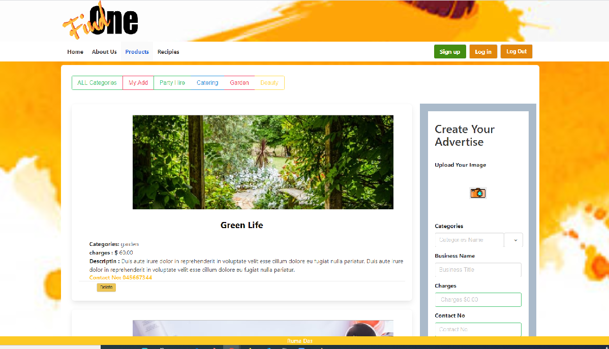

# Description
Find One is a user friendly app where user can ggive advertisement for their small business and let the people know about it.  And User can search the business about  categories.They can also search about different recipes.
It is a secure app only people who is sign up can access the event  and event owner have right to delete event.

## Database Use
 MongoDB / Mongoose: [ https://www.mongodb.com/](http://mongoosejs.com/)

## Daase Model

## Technologies/ Libraries Used:
   * Node.js [https://nodejs.org/en/](https://nodejs.org/en/)
   * Express [https://expressjs.com/]( https://expressjs.com/)
   * React.js[https://facebook.github.io/react/](https://facebook.github.io/react/)
   * Axios[https://github.com/mzabriskie/axios/](https://github.com/mzabriskie/axios/)
   * Json Web Token[https://jwt.io/](https://jwt.io/)
   * Moment Js[ https://momentjs.com/](https://momentjs.com/)
   * Multer [https://github.com/expressjs/multer](https://github.com/expressjs/multer)

## CSS Styling

 Bulma [https://bulma.io/](https://bulma.io/)

## Github Link
    
[https://github.com/RumaRDas/fun-with-color.git](https://github.com/RumaRDas/fun-with-color.git)

## Heroku Link
 [https://protected-headland-56354.herokuapp.com/](https://protected-headland-56354.herokuapp.com/)

     

   
   

        

